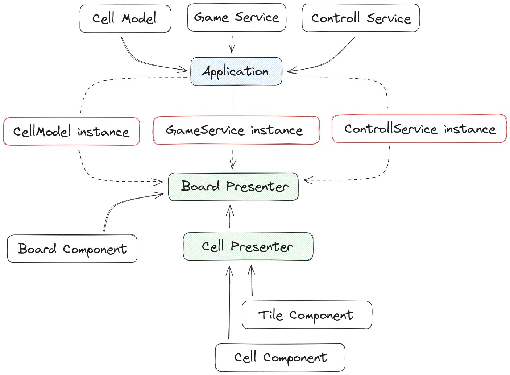

# Игра «2048»

Проект - рефакторинг проекта стороннего разработчика.

## Причина

Проект начался с того, что я наткнулся на видео, в котором демонстрировался процесс разработки игры «2048» ([ссылка](https://www.youtube.com/watch?v=Mhb910JSD4U) на youtube). Идея мне понравилась, но захотелось кое-что добавить и отрефакторить код проекта. Плюс ко всему мне хотелось применить знания, которые получил на курсе [«JavaScript. Архитектура клиентских приложений»](https://htmlacademy.ru/intensive/ecmascript). Я решил что это будет интересно и взялся за работу. :blush:

## Цель

- Инфраструктура

  :white_check_mark: Добавить Typescript

  :white_check_mark: Добавить линтер ESLint

- Архитектура

  :white_check_mark: Организовать код по шаблону проектирования MVP :asterisk:

  :white_check_mark: Вынести код, отвечающий за игровую логику в отдельный сервис

  :white_check_mark: Вынести код, отвечающий за обработку событий в отдельный сервис


:asterisk: Отдельно хочется уточнить. Я не стремился к точной реализации шаблона проектирования MVP. Целью было взять общий принцип разделения кода и применить его к проекту.

## Общее описание

Общая идея - разделить код проекта на основании его задач в проекте, и объединить в соответствующие сущности. Например, выделить код, который отвечает за управление в игре, и создать отдельный сервис. Таким образом, в проекте появились такие сущности, как:

  - Компонент;
  - Презентер;
  - Модель;
  - Сервис.

Работу приложения можно продемонстрировать на следующей схеме:



Получилась структура, где основным «звеном» стал `BoardPresenter`. В нем собираются и объединяются все компоненты и происходит их связывание между собой. Компонент `Application` является «точкой входа», в которой происходит инициализация сервисов, модели и презентеров.

:asterisk: Хочется сразу отметить, что некоторые сущности выглядят излишними. Так, может показаться излишним добавление модели. Однако, ее добавление обусловлено не практическим подходом, а скорее организационным. Хотелось видеть отдельную сущность, которая берет на себя определенные задачи. В данном случае — задачи хранения и сортировки коллекции координат ячеек игровой доски.

## Особенности реализации

- Первоначальный шаблон проекта взят с учебного курса «JavaScript. Архитектура клиентских приложений»;
- Используется конфигурационный файл линтера ESLint от команды «JS авторов». Его можно найти в открытом доступе - [ссылка](https://www.npmjs.com/package/eslint-config-htmlacademy) на NPM;
- (может для кого-то окажется полезным) Функцию `getRandomInt()` взял из репозитория [You don't (may not) need Lodash/Underscore](https://github.com/you-dont-need/You-Dont-Need-Lodash-Underscore#_random);
- Используется логика игры [автора](https://github.com/YuraKoch) оригинального проекта.

## Задачи на будущее

Поскольку данный проект - это скорее эксперимент, то и результат, который вы можете наблюдать, тоже экспериментальный. Мне пока не понятно на сколько далеко я зайду в поставленных целях, но несмотря на это хочется сделать следующее:

  :new: ~~Определиться с логикой в компонентах~~;

  :new: Интересно было бы добавить тесты;

  :new: Попробовать переписать с использованием других шаблонов проектирования.

## Использование

Склонируйте проект и перейдите в директорию проекта:

```bash
git clone https://github.com/kam4atka/2048-ts.git
# or
git clone git@github.com:kam4atka/2048-ts.git

cd ./2048-ts
```

При работе с проектом доступны следующие команды:

  - Установка зависимостей

    ```bash
    npm i
    ```

  - Запуск проекта

    ```bash
    npm start
    ```

  - Сборка проекта

    ```bash
    npm run build
    ```

  - Запуск линтинга кода

    ```bash
    npm run lint
    ```
